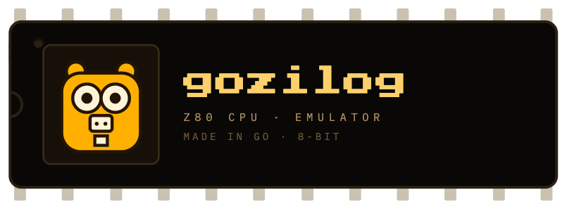

<p align="center">
  
</p>

# gozilog

[](https://pkg.go.dev/github.com/mtrisic/gozilog/z80)
[](https://www.npmjs.com/package/gozilog)
[](LICENSE)

A cycle-accurate Zilog Z80 CPU emulator library in Go. Zero
dependencies, machine-agnostic, with per-T-state timing hooks precise
enough to power machines that use the CPU itself for video generation
(Galaksija, ZX80/81) or contended memory (ZX Spectrum).

**▶ [Try it in your browser](https://mtrisic.github.io/gozilog/demo/)** —
the emulator compiled to WebAssembly, stepping through the example
program with live registers and memory.

**The project is complete.** Every documented and undocumented opcode
implemented; all 1604
[SingleStepTests](https://github.com/SingleStepTests/z80) files pass
with full per-T-state cycle-trace assertions (address/data bus and
control pins at every T-state); ZEXDOC and ZEXALL report all CRCs OK.
See [SPEC.md](SPEC.md) for the design, and [AGENTS.md](AGENTS.md) for
how to build, test and continue development — if AI is your cup of tea.

## Install

```sh
go get github.com/mtrisic/gozilog                      # the library
go install github.com/mtrisic/gozilog/cmd/zrun@latest  # headless runner
go install github.com/mtrisic/gozilog/cmd/zstep@latest # TUI stepper
npm install gozilog                                    # JS/WASM binding (~120 KB gzipped)
```

The npm package ([`gozilog`](https://www.npmjs.com/package/gozilog),
see [bindings/npm](bindings/npm)) wraps the emulator compiled to
WebAssembly with TinyGo and is differentially verified against the
reference Go build on every release.

## Quickstart

Development happens exclusively inside the devcontainer: open the folder
in VSCode, "Reopen in Container" (first build downloads the ~280 MB test
suite), then press **F5** — it assembles `examples/hello_from_z80.asm`
with pasmo and runs it in the emulator under the debugger.

From a terminal inside the container:

```sh
mkdir -p build
pasmo examples/hello_from_z80.asm build/hello_from_z80.bin
go run ./cmd/zrun -org 0x8000 build/hello_from_z80.bin    # run to HALT, print RAM dump
go run ./cmd/zstep -org 0x8000 build/hello_from_z80.bin   # interactive TUI stepper
go test ./... -short                                      # tests incl. SingleStepTests
go test ./...                                             # …plus ZEXDOC/ZEXALL (~4 min)
(cd cmd && go test ./...)                                 # runner + golden-dump test
```

`zstep` shows live registers (including WZ/MEMPTR, I, R, IM, IFFs and
decoded flags) and a memory view that can follow PC, HL or SP while you
single-step, run bursts, or run to HALT.

## Using the library

```go
import "github.com/mtrisic/gozilog/z80"

// A machine is anything implementing z80.Bus (and optionally
// z80.Ticker for per-T-state timing, z80.IntAcker for INT vectors).
type Machine struct{ mem [65536]byte }

func (m *Machine) MemRead(a uint16) byte     { return m.mem[a] }
func (m *Machine) MemWrite(a uint16, v byte) { m.mem[a] = v }
func (m *Machine) IORead(p uint16) byte      { return 0xFF }
func (m *Machine) IOWrite(p uint16, v byte)  {}

func main() {
    m := &Machine{}
    cpu := z80.New(m)
    for !cpu.Halted() {
        cpu.Step()
    }
}
```

The full embedder contract — including the timing model that lets a
machine implement video generation and memory contention — is documented
in the godoc of `z80.Bus`, `z80.Ticker` and in [SPEC.md](SPEC.md).

## Acknowledgements

This emulator would not be verifiable without the work of the
retro-computing community:

- [SingleStepTests/z80](https://github.com/SingleStepTests/z80) —
  ~1.6 million per-instruction test cases with per-T-state bus traces;
  the primary correctness gate for this project.
- **ZEXDOC / ZEXALL** by Frank D. Cringle (binaries fetched from
  [agn453/ZEXALL](https://github.com/agn453/ZEXALL)) — the classic
  instruction exercisers with CRCs recorded from real hardware.
- *MEMPTR, esoteric register of the Zilog Z80 CPU* by the zx.pk.ru
  research group ("Boo-boo"), English translation by Vladimir Kladov.
- *The Undocumented Z80 Documented* by Sean Young and Jan Wilmans.
- Tony Brewer's research on the
  [Z80 special reset](http://www.primrosebank.net/computers/z80/z80_special_reset.htm).
- [redcode/Z80](https://github.com/redcode/Z80),
  [ha1tch/zen80](https://github.com/ha1tch/zen80) and
  [remogatto/z80](https://github.com/remogatto/z80), studied as
  behavioral references (no code was ported or copied from them).

## Disclaimer

This project is not affiliated with or endorsed by Zilog, Inc. Zilog
and Z80 are trademarks of their respective owners. The name "gozilog"
refers to the CPU this library emulates, not to the company.

This software is provided "as is", without warranty of any kind — see
[LICENSE](LICENSE) for the full terms. Use at your own risk.

## WebAssembly

The library is a first-class WASM citizen: it compiles unmodified for
both official Go targets, and the full verification suite (all 1604
SingleStepTests files including per-T-state cycle traces) passes under
both runtimes. `bash tools/check-wasm.sh` (inside the devcontainer) is
the gate: build checks, the test suite under wasmtime (`wasip1`) and
Node (`js`), a cross-architecture determinism proof (the wasm-compiled
`zrun` reproduces the committed golden RAM dump), and a headless check
of the browser demo.

The browser demo is hosted at
**<https://mtrisic.github.io/gozilog/demo/>** — or run it locally:

```sh
cd examples/wasm
bash build.sh        # assemble example, copy wasm_exec.js, compile to WASM
go run ./serve       # → http://localhost:8080
```

The demo page steps the CPU through `hello_from_z80.asm` with live
registers and memory (`z80Load`/`z80Step`/`z80Run`/`z80State`/`z80Mem`
exposed via syscall/js) — the seed of a browser-based machine emulator.
Only `cmd/zstep` stays native-only (it needs a real terminal).

The project site deploys automatically to GitHub Pages on every push
to `master` (`.github/workflows/pages.yml` + `tools/build-site.sh`:
this README rendered as the homepage, the demo under `/demo/`; the
workflow enables the Pages site itself on first run). The demo page
must be served over HTTP; opening `index.html` from disk is blocked by
browsers, and the page says so if you try.

## Contributing

Contributions are welcome — **human and AI alike**. The repo is built
for both: [AGENTS.md](AGENTS.md) gives any contributor (carbon- or
silicon-based) the working rules, the test suites make correctness
non-negotiable, and the devcontainer means there is exactly one
"works on my machine". Open an issue or a PR.

If gozilog is useful to you, **star** it so others can find it — and a
**fork** is how the next machine emulator gets born. If you build
something on top of it (a Galaksija? a Spectrum? something stranger?),
please do tell.

## License

MIT — see [LICENSE](LICENSE). The test data downloaded by the
devcontainer (SingleStepTests JSON, ZEX binaries) is *not* part of this
repository and carries its authors' own licenses.
